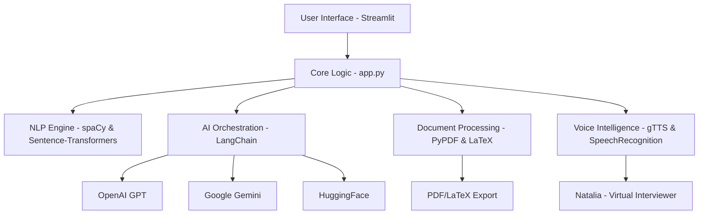

# 🛡️ AI Resume Intelligence Hub

[](https://www.python.org)
[](https://streamlit.io)
[](https://www.docker.com)
[](https://langchain.com)

**The AI-Resume-Screener project is a sophisticated, Python-powered web application built with a modern stack focused on AI, NLP, and interactive data visualization.**


---

## 🚀 Key Features

<details>
<summary><b>🧠 Advanced AI Screening</b></summary>
Orchestrates multiple LLMs (OpenAI, Gemini, HuggingFace) via LangChain for deep semantic analysis and candidate ranking.
</details>

<details>
<summary><b>📊 Neural Analytics</b></summary>
Interactive Plotly visualizations and NetworkX skill graphs to visualize candidate-job fit.
</details>

<details>
<summary><b>🎙️ Mock Interviews</b></summary>
A vocal personality ("Natalia") powered by gTTS and Speech-to-Text for immersive candidate assessment.
</details>

<details>
<summary><b>📄 Resume Studio</b></summary>
Generate industry-standard LaTeX resumes or HTML-based templates on the fly.
</details>

---

## 🏗️ Technology Stack

### 🧠 Artificial Intelligence & NLP
- **LangChain**: Orchestrates LLM integrations.
- **LLM Providers**: OpenAI, Google Gemini, and HuggingFace.
- **spaCy**: Advanced NLP for entity recognition and feature extraction.
- **Sentence-Transformers**: Semantic matching for similarity computation.

### 📊 Data Analysis & Visualization
- **Pandas & NumPy**: Data manipulation and scoring logic.
- **Plotly**: Premium interactive charts and distribution analysis.
- **NetworkX**: Complex skill network visualizations.
- **Scikit-learn**: Machine learning utilities for ranking.

### 📄 Document Processing
- **PyPDF**: PDF text and metadata extraction.
- **PyLaTeX & LaTeX**: Generation of professional LaTeX resumes.
- **xhtml2pdf**: Conversion of HTML templates to PDF.

### 🎙️ Audio & Voice Intelligence
- **gTTS**: Google Text-to-Speech for Natalia's personality.
- **SpeechRecognition**: Voice-to-text conversion for interview answers.

---

## 🏗️ Project Architecture



---

## 📁 Project Structure

```text
AI-Resume-Intelligence/
├── assets/             # Images, logos, and UI assets
├── data/               # Local storage for resumes and user data
│   ├── system_resumes/ # Cached/Uploaded resumes
│   └── users.json      # Local user database
├── src/                # Modularized source code
│   ├── parse_resume.py # PDF extraction logic
│   ├── rank_candidates.py # AI scoring & ranking
│   ├── resume_editor.py # Studio & Template logic
│   ├── auth.py         # User authentication
│   └── ...             # Other feature modules
├── app.py              # Main Streamlit application entry point
├── Dockerfile          # Container configuration
├── requirements.txt    # Python dependencies
└── README.md           # Documentation
```

---

## 🚢 Infrastructure & Deployment

- **Docker**: Containerized deployment via `docker-compose.yml`.
- **Streamlit**: Responsive, dark-themed UI built natively in Python.
- **Custom CSS Design System**: Features Google Fonts (Outfit), Glassmorphism, and micro-animations.

---

## 🛠️ Installation & Setup

1. **Clone the Repository**
   ```bash
   git clone https://github.com/your-username/AI-Resume-Intelligence.git
   cd AI-Resume-Intelligence
   ```

2. **Setup Virtual Environment**
   ```bash
   python -m venv .venv
   source .venv/bin/activate  # On Windows: .venv\Scripts\activate
   ```

3. **Install Dependencies**
   ```bash
   pip install -r requirements.txt
   python -m spacy download en_core_web_lg
   ```

4. **Environment Variables**
   Create a `.env` file and add your API keys:
   ```env
   OPENAI_API_KEY=your_key
   GEMINI_API_KEY=your_key
   HF_TOKEN=your_token
   ```

5. **Run the Application**
   ```bash
   streamlit run app.py
   ```

---

### 🐳 Quick Start with Docker

The easiest way to get started is using Docker Compose:

```bash
docker-compose up --build
```

The application will be available at `http://localhost:8501`.

---

## ✨ Design Aesthetics

The UI utilizes a **Custom CSS Design System** embedded in `app.py`, featuring:
- **Premium Typography**: Google Fonts (Outfit).
- **Glassmorphism**: High-end feel with translucent card effects.
- **Dynamic Gradients**: Responsive background and interactive element styling.

---
